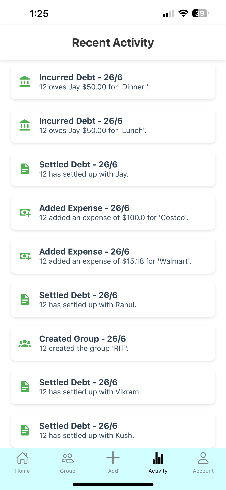
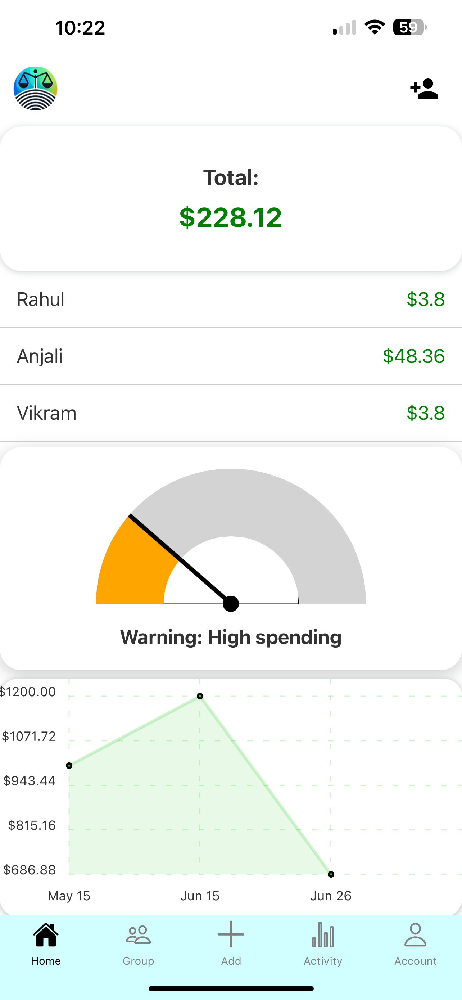
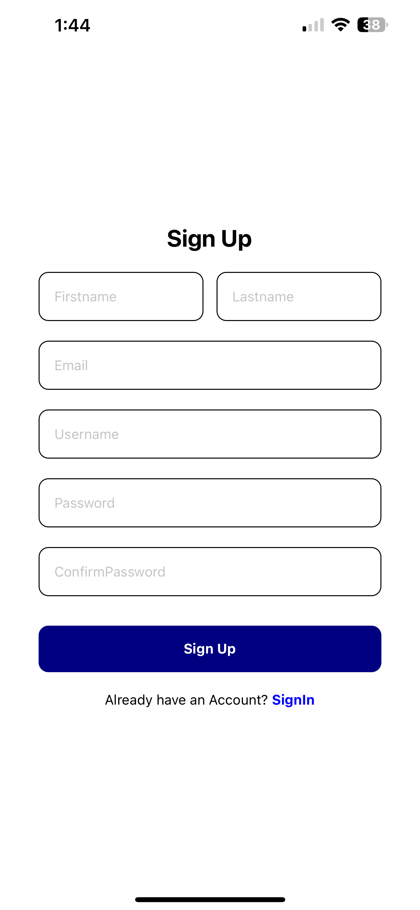

# EquiPay

## Project Definition

This project is a functional clone of Splitwise, designed to simplify the management of shared expenses among friends and group members. Our application enables users to efficiently track and split costs, enhancing personal finance management through an intuitive and user-friendly interface.

### Key Features:

- **Expense Tracking with Friends and Groups**: Allows users to add, update, view, and delete shared expenses, ensuring everyone is on the same page with minimal effort.
- **Profile and Image Management**: Supports complete profile management with AWS S3 integration for secure image storage, along with AWS Textract to automate data extraction from receipts, making expense logging quick and accurate.
- **Visual Analytics**: Provides visual tools such as meters and graphs to help users gain insights into their spending patterns, offering a clear view of net expenditures.
- **Activity Log and Account Management**: Tracks user activities within the app and offers robust account management options, including account deletion and deactivation features.
- **Secure Authentication System**: Focuses on security with an enhanced login/signup interface, ensuring data integrity and user privacy.

This Splitwise clone aims to deliver a comprehensive solution for expense management, blending essential features with advanced technology to meet the demands of modern users looking to manage their finances more effectively.

## MVP Features Overview

This application aims to simplify the management of shared expenses and personal finance through a range of robust features:

### Expense Management

- **Add Expense with Friends**: Allows users to directly add and track expenses shared with individual friends, facilitating easy split and management of costs.
- **Add Expense with Group Members**: Enables users to manage expenses within a group setting, perfect for situations like trips, shared accommodations, or group activities, ensuring all group-related financial transactions are recorded and split accordingly.
- **CRUD Operation on Expense**: Complete management of expenses including creating, reading, updating, and deleting expenses, ensuring users can easily maintain their financial records.

### Profile and Data Management

- **CRUD Operations on Profile Including Profile Picture**: Users can create, read, update, and delete their profile information. Includes uploading and managing profile pictures, with storage provided by AWS S3 for reliability and scalability.
- **AWS S3 for Profile Picture Storage**: Utilizes Amazon S3 for secure, scalable, and durable object storage, ensuring that user profile pictures are safely stored and readily accessible.
- **AWS Textract for Image Text Extraction**: Integrates AWS Textract to extract text from images, streamlining the process of capturing and converting expense-related data from receipts or invoices into digital form.

### Analytics and User Engagement

- **Data Visualization on Total Amount (Net Amount)**: Features visual tools such as meters or scorecards to help users understand their spending behavior by displaying net amounts, enabling better financial decisions.
- **Adding Recent Activity**: Tracks and displays recent user activities, providing a chronological insight into all actions taken by the user within the app, enhancing user engagement and record-keeping.

### Account and Security

- **Managing the Account (Delete)**: Provides the ability to manage account settings, including the deletion or deactivation of the user account, ensuring users have full control over their data and participation.
- **Better UI/UX of Login/Signup Page for Secure Signup**: Delivers a seamless, intuitive login and signup experience, emphasizing user-friendly design and enhanced security measures to protect user data and simplify the entry process.

Each feature is designed to offer a comprehensive solution for managing shared expenses effortlessly, reflecting our commitment to providing an intuitive and functional financial tool.

## Application Page Overviews

### Account Page

- **Profile Management**: Users can view their profile, change passwords, and access advanced features.
- **Edit Profile**: Allows users to update their personal information and manage their account.
- **Contact Us**: Provides a direct communication link to address user queries or issues.

### Recent Activity Page

- **Activity Log**: Displays all recent activities such as debts incurred, expenses added, and settlements, helping users keep track of financial movements.

### Add Expense Page

- **Expense Entry**: Users can quickly add expenses by entering amounts, descriptions, and optionally include themselves in the split.
- **Image Upload**: Offers the option to upload an image for better documentation of the expense.

### Friends and Groups Management

- **Choose Members Page**: Allows users to select friends to create or manage groups.
  
- **Friends Dashboard**: Provides detailed views of financial interactions with individual friends, including outstanding amounts and transaction history.
  
- **Groups Page**: Lists all groups that the user is a part of, with options to add or manage group members.
  
- **Add Group Members**: Users can add new members to existing groups, enhancing the collaborative management of expenses.
  
- **Group Dashboard**: Displays detailed information about group expenses, member balances, and allows for easy settling of shared costs.
  

### Home Page

- **Overview of Finances**: Provides a snapshot of the user’s total balance, offering insights into financial status and recent transaction summaries.

### Signup and Login Pages

- **User Onboarding**: Facilitates new user registration with a straightforward signup form and secure login mechanism.
  
  

This overview provides a comprehensive guide to the functionality and layout of each page within the application, aiding users and developers in navigating and understanding the software.

## Technology Stack

EquiPay leverages a robust stack of modern technologies to provide a seamless and efficient user experience:

- **Frontend**: Developed with **React Native**, offering a responsive and intuitive interface across various mobile platforms.
- **Backend API**: Powered by **Python Flask**, this RESTful API ensures reliable data handling and integration between the frontend and database layers.
- **Database**: Utilizes **AWS PostgreSQL RDS** for secure and scalable data storage, ensuring high availability and performance.
- **Document Processing**: Integrates **AWS Textract** for advanced text extraction from images, aiding in automated data entry from uploaded receipts.
- **Image Storage**: Uses **AWS S3** for secure and durable storage of images and documents, allowing efficient retrieval and management.
- **Orchestration and Scaling**: Employing **AWS Kubernetes** with a LoadBalancer to manage containerized application deployment, ensuring scalability and resilience.

This combination of technologies ensures that EquiPay can handle complex operations efficiently, from user management to real-time data processing and analytics.
